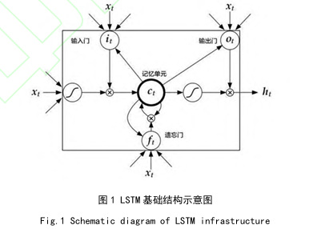
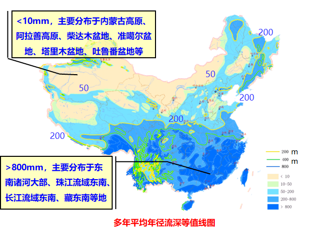
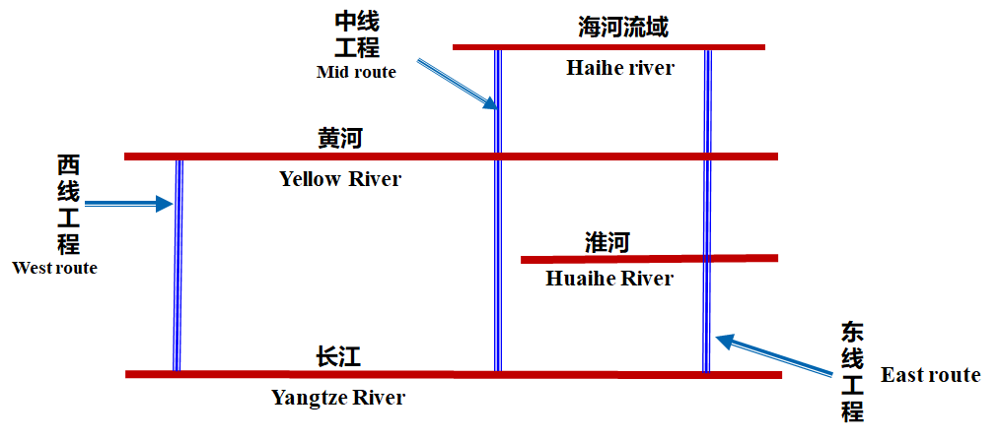
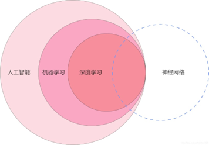
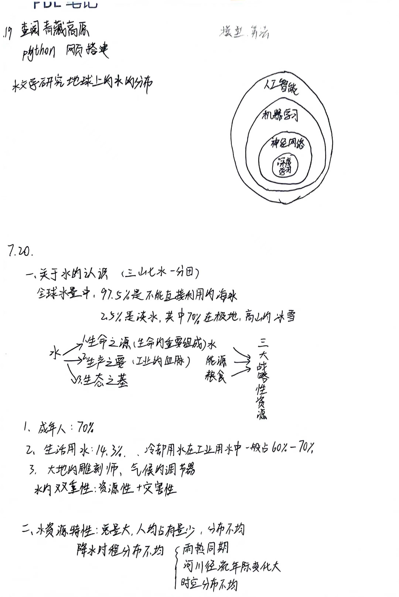
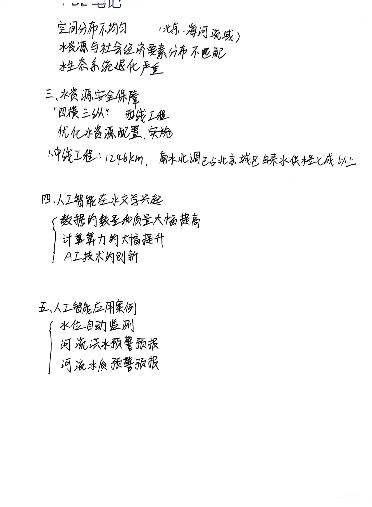
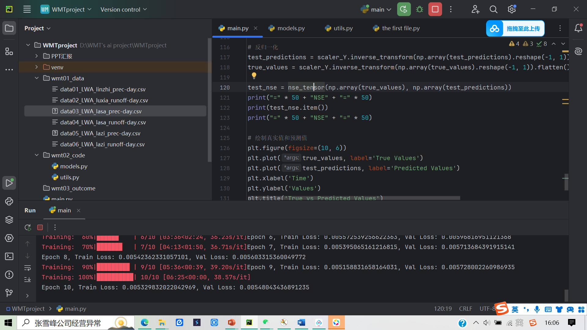
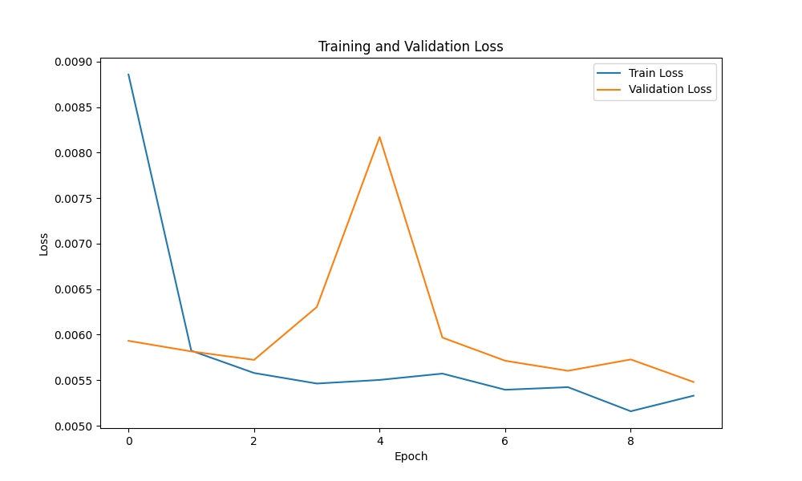
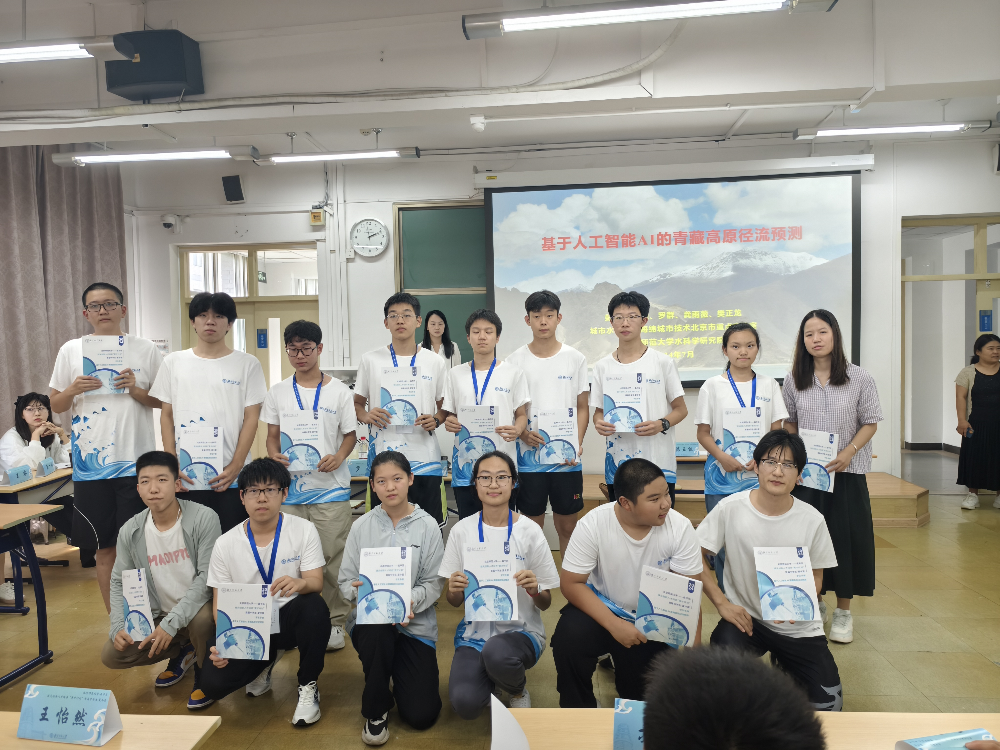
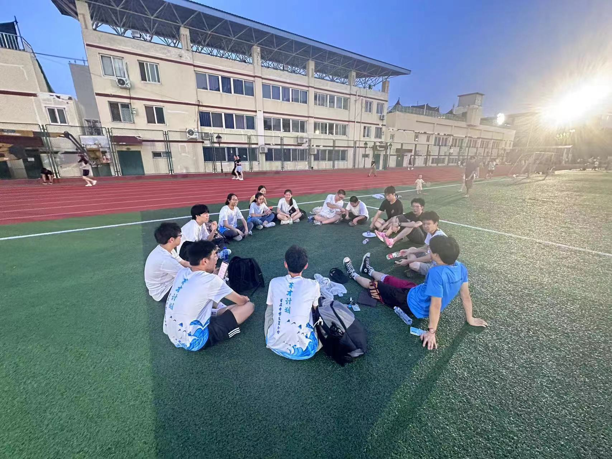

# ***基于人工智能AI青藏高原径流预测***

## ***AI第3极——第三组***
## ***团队宣言：***
- 全力以赴 我们最酷

  
## ***成员介绍***
### **导师：**
- **彭定志教授**
- **罗群老师**
- **龚雨薇老师**
- **樊正龙老师**
### **学员:**
- **常琛：**   高二  昌平区第二中学          情绪智慧掌控担当
- **白博远：** 高二  昌平区实验学校      
- **侯博文：** 高二  北师大二附未来科学城    好成员担当
- **邬明廷：** 高一  昌平区第二中学    python技术担当
- **赵弘毅：** 初二  昌平区实验学校
- **袁绍轩：** 初二  首师大附育新学校      摄像担当

## ***目录***
1. 研究背景
2. 研究方法
3. PBL笔记
4. 数据处理与模型构建
5. 美好的瞬间
6. 收获与感受
7. 导师寄语
## ***一、研究背景***

### *人工智能的概念与其在水文方面的应用*
  随着机器学习解决了深层网络梯度消失的问题后，人工智能得到了跨越式发展，促使社会各方面发生巨大变革。人工智能技术包括神经网络算法模型、机器学习算法模型，因其处理非线性和不确定性的强大能力，在水文预报领域取得了丰硕的研究成果。随着人工智能工作领域的不断扩展，传统水文业务也需要适应新的数据模式的冲击，构建人工智能模型，从数据的角度进行业务分析，多维度、多方法地保证水文业务的精确性与高效性，能够有效地为系统水情预报测报业务提供技术支持，为水库的多目标规划调度提供科学依据。本案例基于人工智能核心神经网络算法构建青藏地区河流径流预测模型。改编自《青藏高原东南部径流特征的空间规律及控制因子研究》

### *青藏高原的河流径流特点*

青藏高原作为“亚洲水塔”，是众多大江大河的发源地，其河流径流具有显著的特点：
- 水量丰富：青藏高原的河流径流主要来源于冰川融水和降水，这些河流为下游地区提供了重要的水资源。
- 季节性明显：由于青藏高原的气候特点，河流径流表现出明显的季节性变化。夏季降水增多，冰川融水增加，河流径流量增大；而冬季则相反，河流径流量减小。
- 内流外流并存：青藏高原的河流分为内流河和外流河。内流河主要注入高原内部的湖泊或消失于荒漠之中；外流河则注入太平洋、印度洋等大洋。
- 受气候变化影响显著：青藏高原的河流径流受气候变化的影响显著。随着全球气候变暖，冰川融化加速，河流径流量可能发生变化。同时，降水模式的改变也可能对河流径流产生影响。

### *青藏高原径流预测意义与价值*
青藏高原幅员辽阔、地势挺拔，发源了长江等亚 洲东部及南部主要大河，是我国东部地区的重要水源地。青藏高原受多个环流系统共同控制，包括太平洋季风、印度洋季风和西风南支等，因此该地区水文过程对区域气候变化敏感。受气候变化影响，青藏高原气温呈上升趋势，降水量变异性增大，掌握气候变化条件下该区域径流特征，将对我国东部地区水资源管理与保护具有重要实际意义。摘自《青藏高原东南部径流特征的空间规律及控制因子研究》

### *河流水文学与水科学*
河流水文学是陆地水文学的分支学科，是研究河流水文现象、过程及其基本规律，为防治灾害和河流开发提供河流水情和河川径流资源等基本数据，主要依靠沿河布设水文站网及通过河流水文考察来获得水文信息。
水科学（aquatic science）是一门研究水的物理、化学、生物等特征，分布、运动、循环等规律，开发、利用、规划、管理与保护等方法的知识体系。

### *将AI应用于河流径流预测——长短期记忆人工神经网络*
长短期记忆人工神经网络（long short-term memory，LSTM）与标准的RNN模型结构基本相同，但拥有更加细化的内部处理单元，能真正有效地利用长距离的时序信息。LSTM包含特殊的细胞状态和门结构，可动态地控制时间序列信息的流动和保存，能够捕获水文变量间长时间的依赖性和水流路径连通性的变化，从而提高了径流的模拟精度。摘自《基于LSTM的青藏高原冻土区典型小流域径流模拟及预测》

## ***二、研究方法***
基于长短期记忆网络的径流预测模型 
长短期记忆网络（LSTM）是一种特殊的循环神经网络，是一种循环神经网络的变体，经过改进以解决长序列数据处理中的梯度消失和梯度爆炸问题。
梯度是神经网络训练中的重要参数，在反向传播过程中，用于更新神经网络权重。由于神经网络中的层数增加，每层之间的梯度会以乘法的形式进行叠加，梯度值很小则会在接下来的反向传播中逐渐消失或者梯度值过大则会出现梯度爆炸的情况。LSTM 的作用是解决梯度消失和梯度爆炸问题，使得LSTM能够处理持续时间较长的序列数据。 
- LSTM 主要结构包括输入门、遗忘门、记忆单元和输出门，如图1所示。

- 输入门：控制着有多少信息可以被写入到记忆单元中，也就是决定这一次的输入应该如何处理。 
- 遗忘门：遗忘门控制着前一时刻的记忆单元中的多少信息需要被丢弃，同样受当前的输入以及前一时刻的输出的影响。 
- 记忆单元：记忆单元存储着序列中所有时刻的重要信息，数据流通过输入门或遗忘门得以进入或被遗忘，在不断被更新和改变。 
- 输出门：决定了什么信息从这个时刻的记忆单元中输出，通过当前的单元状态得到输出的各个成分，进一步计算出本时刻的输出。

## ***三、PBL笔记***

### *（一）大数据*
- 大数据:难以用常规的数据库管理技术和工具处理的数据集 特点：大量化、多样、快速、价值密度低
- 大数据应用:数据采集(感知技术)、存储（云技术)、分析(人工智能)、可视化(回表和仪表盘)

  
### *（二）水的认识*
- 水是基础性的自然资源和战略性的经济资源；经济社会发展的重要支撑和保障；生态环境的控制性要素，水资源的可持续利用是支撑社会经济发展的战略问题
1. 生命之源：水是生命的重要组成部分，也是动植物和人体体内的重要的组成;人类生活饮用、卫生洗涤等都离不开宝贵的水资源。
- 不同年龄段人体的水分含量：新生儿：90%
少年：80%
成年人：70%
老年人：60%
生命即将结束：50%

2. 生产之要
 - 2018年全国总用水量6015亿。其中，生活用水占用水总量的14.3%；工业用水占用水总量的21.0%；农业用水占用水总量的61.4%；人工生态环境补水占用水总量的3.3%。
水是工业的血脉。水参与了现代企业生产的重要环节，被誉为“工业的血液”。
3. 生态之基
 - 水是生境的基本组成，是生态系统营养传输的介质。
- 水是生态系统中的控制性要素。
- 水是大地的雕刻师。
- 水是气候的调节器。

- ***水文学基本认识***
1. 水文学是研究地球上水的性质、分布、循环、运动变化规律及其与人类社会间相互联系的科学
2. 水循环过程与水文要素，降水（降雨、降雪等）、下渗、蒸发、径流（地表径流、地下径流等）等

- ***水资源的特征***
1. 水资源禀赋—总量大，人均占有量少
2. 降水时程分布不均
3. 水资源空间分布不均匀

4. 水资源与社会经济要素分布不匹配
5. 水生态系统退化严重

- ***水资源安全保障***
优化水资源配置，实施跨流域调水工程，增强水资源供给能力

- 上图为南水北调工程总体布局示意图
（4横3纵实现4流域水资源优化配置——中国水网）

- ***人工智能在水文学兴起***
-	数据的数量和质量大幅提高：随着传感器技术和遥感技术的发展，大量水文数据不断产生，涵盖了地表水、地下水、降水、蒸发等各方面。这些数据的可用性为AI算法的训练和应用提供了丰富的基础。
-	计算算力的大幅提升：随着计算机硬件和云计算技术的进步，人们可更轻松地处理和分析大规模的水文数据，从而支持复杂的AI模型和算法应用。
-	AI技术的创新：深度学习等新兴AI技术的出现为水文水生态研究提供了新的工具和方法，使得对复杂水循环过程的建模和预测变得更加容易、高效和准确。

## **（三）.常用AI算法和技术**

神经网络技术:深度学习、人脸识别、自动驾驶
 
机器学习:对计算领域要求较低(推荐系统、语言识别)

深度学习:需要大量的计算资源,尤其是GPU加速;机器学习的子领域

- ***AI成功应用案例***
- 水位自动监测：观测站安装摄像头开展水位或流量监控，但摄像头观测和图像监管等依据传统人工耗时耗力，应用AI技术，将原有摄像头转变为智能化摄像头，利用智能化摄像头图像处理识别技术和机器学习，可为河流、湖泊等水位监控提供快速解决方案，降低人工成本和项目投资
- 河流洪水预警预报：可通过自主学习技术简化复杂的数学模型，提升洪水预报效率和避免原有复杂建模过程
-	河流水质预警预测：利用人工神经网络自适应方法及多种AI算法，可对复杂的水环境水质变化及其生物化学过程集成模拟和预警预测，为河流水质保护与生态恢复提供重要的工具
  
## ***（四）Python语言***
- 数据类型：Python 有多种内置数据类型，如整数、浮点数、字符串、列表、元组、集合和字典。复合型数据类型，如数组和张量通过第三方库（如NumPy和PyTorch）实现。

  
- 类的定义：类是面向对象编程的核心概念。类通过class关键字定义，包含属性和方法，可用于创建对象实例。
- 函数的定义：函数是组织代码的基本单元，用于执行特定任务。函数通过def关键字定义，执行特定任务，并可通过参数和返回值与外部代码交互。在Python 中，我们可以使用文档字符串（docstring）为函数添加注释，描述其功能、参数和返回值。
  

  
这些概念构成了Python 编程的基础，理解它们有助于编写结构良好、功能强大的代码

  
### ***手写PBL笔记总结***

## ***四、数据处理与模型构建***

## ***五、美好的瞬间***

## ***六、收获与感受***

- **常琛：**    我经由浓荫满地的银杏树，庄严肃穆的教学楼；我穿过岁月有痕的校史馆，国家重点的实验室；我了解水文学、AI技术、python编程的相关知识；我掌握用AI构建模型，AI技术对青藏地区的河流径流预测；我探索水科学的无穷魅力与奇妙。在这里，我与老师交流沟通，与同学团结协作，与水科学亲密接触，收获颇丰！
  
- **邬明廷：** 身处在百年师大的校园，我感到被历史的底蕴包围，心情激动。这次为时6天的活动让不仅我收获了友谊，更让我感受到了ai科技的效率。我认为学习如何与ai打交道很有意义，这可以训练我们的逻辑思维能力和解决以目标为导向的问题，真正达到培养科学思维的目的。最后，我想感谢三位导师和同学们，感谢我们在BNU相见。

- **白博远：** 很充实很忙碌，在繁重的任务重也有很多快乐......

- **赵弘毅：** 在2024年7月18号我来到了北京师范大学参加了北京师范大学举办的英才计划夏令营的第二期，主题为研究水科学，我来到这里是希望可以学习到很多关于水科学的新知识，期待交到新朋友。这里的环境十分优美，我们在第一天和第二天上午听了讲座，并在第二天下午进行了分组，我进入了第三个项目的小组，在团队中进行着寻找资料的任务。在第二天晚上我们小组进入了图书馆查找资料。在第三天学习了python的AI模型架构和网站的搭建并在晚上在西操场进行扔飞盘的团队破冰行动。在第四天我们进行pythonAI模型构建的进一步深入探索。在第五天我们上午听了讲座并在下午对模型架构的进一步完善和完善网站，并预计在晚上在小组内进行成果汇报。在第五天进行我们准备进行小组成果展示以及成果汇报。在这几天我学习到了团队合作和python语言的一部分。虽然夏令营还没有结束但我却对这次夏令营十分不舍，我希望下次还可以来。

- **侯博文：** 通过6天的学习生活学到了许多关于地理和计算机的知识，使我的假期生活更加的充实
  
- **袁绍轩：** 在本次活动中我为我们组每位成员制作了一个表情包，本次活动中我学习到了团结的力量，我也学习到了水的知识，我认为这次活动对我很有意义，他不仅能锻炼我们的自理能力还能让我们学习到知识还能建立友谊

## ***七、导师寄语***
正值炎炎夏日，同学们一同来到北师大水科学研究院，开启期待了属于自己的夏令营时光🥳。在朝夕相伴的日子里，我们之间的沟通没有拘谨，谈论理想👑，讨论职业👮🏻‍♀️，思考未来🧐……总是有源源不断的话题引发大家的兴趣与思考。其中，在聆听彭定志教授的讲座的过程中，你们求知的眼神和认真的态度，最让我欣慰🤠。同学之间相互合作，彼此包容，互相探讨编程代码问题，在我心中留下了深刻的印象。在这几天相处的时光里，我看到了你们的积极进取💪🏻，感受到了你们丰富多彩的校园时光🙌，了解到了你们对未来美好🌟的憧憬。
星光不负赶路人🏃🏻，江河眷顾奋楫者🚣🏻‍♀️。加油吧少年们，向美好的未来冲锋！

